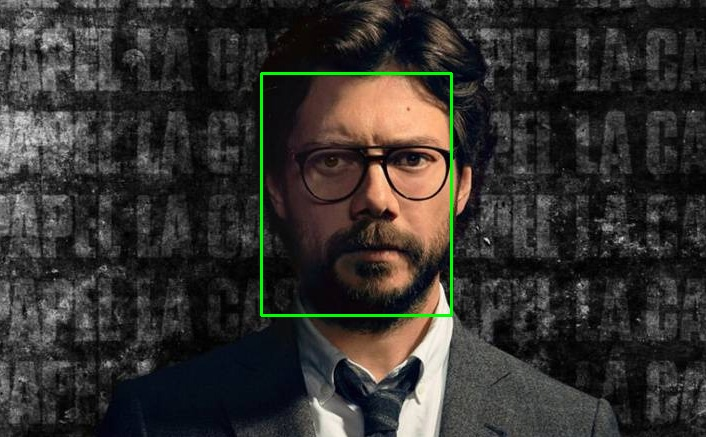
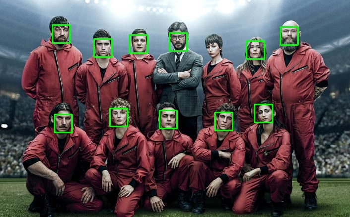
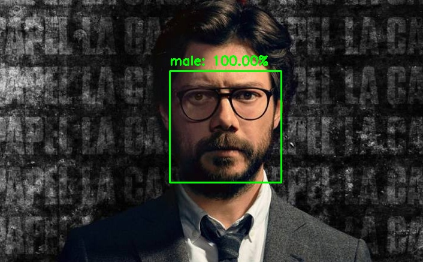
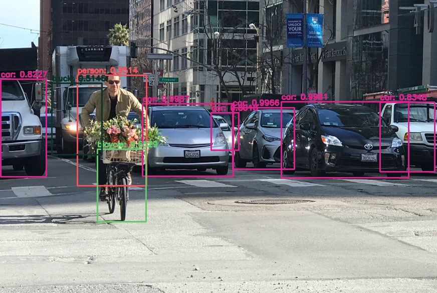
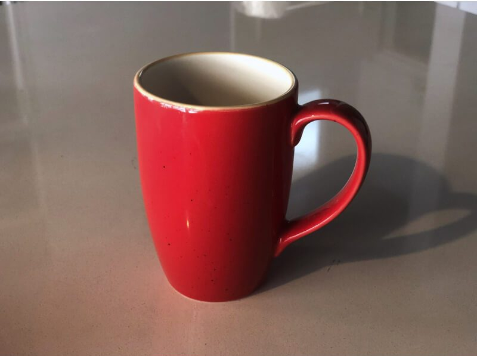
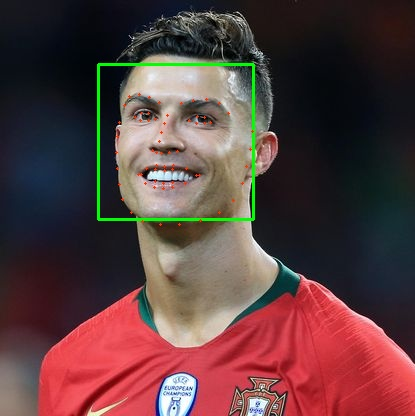

.jpg)

# Visionlib


A simple high level API made for assisting in CV-related projects.

## Features

- Track faces using
  - MTCNN module
  - Dlib hog Based detector
  - Opencv Haar cascades
  - Dnn based model
- Predict Gender
- Detect Objects
  - Yolo v3
  - tiny-yolo

### Installation

**Note:** Windows compatibility is not tested

#### Dependencies

`sudo apt-get install build-essential cmake pkg-config`

`sudo apt-get install libx11-dev libatlas-base-dev`

`sudo apt-get install libgtk-3-dev libboost-python-dev`

This should install Dependencies required by dlib.

`pip install visionlib`

This will install visionlib.

##### Optional

If You want to install from source
`git clone https://github.com/ashwinvin/Visionlib.git`

`cd visionlib`

`pip install .`

### Face Detection

Detecting face in an image is easy . This will return the image with bounding box and box coordinates.

`from visionlib.face.detection import FDetector`

`detector = FDetector()`

`detector.detect_face(img, show=True)`

This would detect face and display it automatically.

`detector.set_detector("mtcnn")`

Don't like the default detector?, change it like this.

#### Examples





### Gender Detection

Once face is detected, it can be passed on to detect_gender() function to recognise gender. It will return the labels (man, woman) and associated probabilities. Like this

```python
from visionlib.gender.detection import GDetector
detector = GDetector()
pred, confidence = detector.detect_gender(img)
```


##### Example



### Object Detection

Detecting common objects in the scene is enabled through a single function call detect_objects(). It will return the labelled image for the detected objects in the image. By default it uses yolo v3-tiny model.

```python
from visionlib.object.detection import Detection
import cv2
detector = Detection()
d_img = detector.detect_objects(img)
```

#### Example



### Object Classification

You can also do object classification with the `CDetector` class.

- Currently it has three detector's
  - Inception v3
  - VGG 16
  - Xception

```python
from visionlib.object.classifier.detection import CDetector
predictions = detector.predict(img)
```

#### Example



##### Output

```
Detected coffee_mug with confidence 73.33419919013977
Detected cup with confidence 8.287159353494644
Detected pitcher with confidence 3.0803868547081947
Detected coffeepot with confidence 1.2160349637269974
Detected water_jug with confidence 0.8919732645153999

```

###  Keypoint Detection

You can pass a detected face into the keypoint detection and get all the detected keypoints.
- Currently it has two detector's :
	- Dlib's 68 keypoint shape detector
	- MTCNN's 5 point detector
	

```python
from visionlib.keypoints.detection import KDetector
kdetector = KDetector()
points = kdetector.detect_keypoints(img, rects=boxes)
```

#### Example



#### GPU support

You can leverage your gpu's power by enabling it like this.

**Face Detection**
`detector.detect_face(img, show=True, enable_gpu=True)`

**Object Detection**
`detector.detect_objects(img, enable_gpu=True)`

**Gender Detection**
`detector.detect_gender(img, enable_gpu=True)`


#### Loading videos from YouTube

If you want load videos from YouTube, you can use the  `load_video()`function.

```
from visionlib.utils.webutils import web
web_util = web()
video = web.load_video(url)
```

You can now pass the video to any function. It does contain the video but it instead grabs the source URL of the video

#### Documentation

Complete Documentation can be found on 
https://ashwinvin.github.io/Visionlib/

For example check the examples directory


None of the images in the this repository are owned by me.
They belong to there respective owners.
